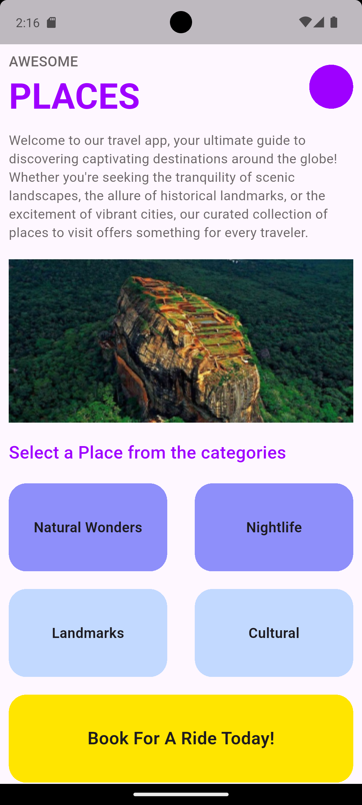
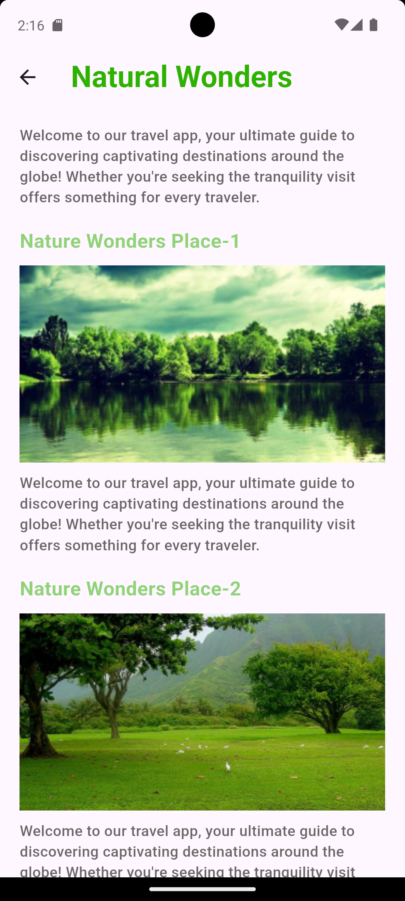
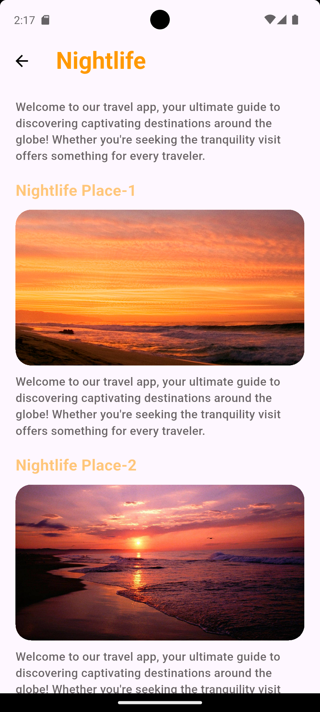
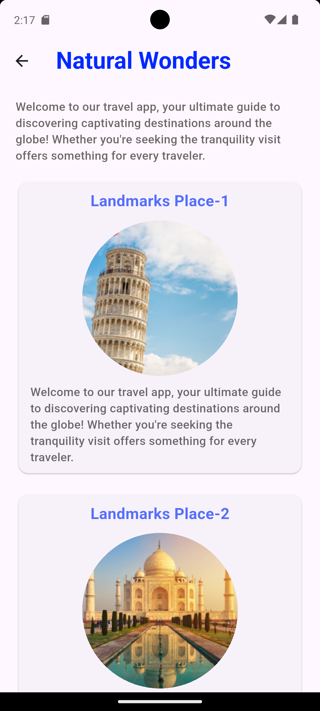
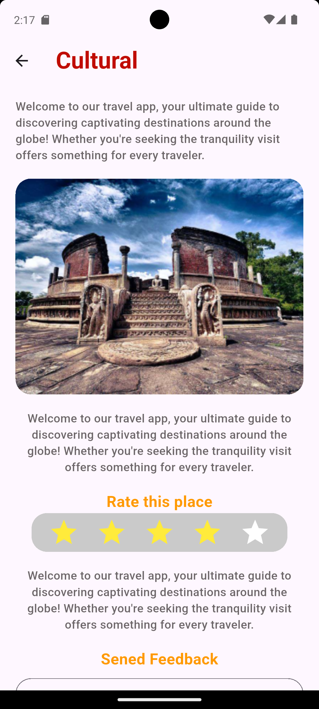
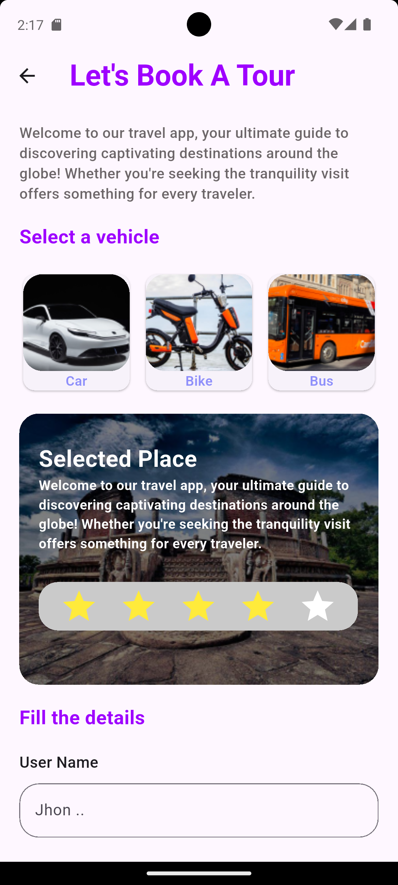
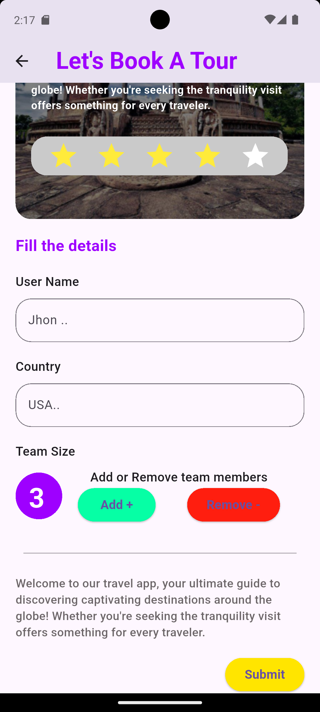

# Awesome Places App

A comprehensive Flutter learning project demonstrating professional folder structure, reusable widgets, and modern Flutter development practices.

## 📱 About This Project

This project is a **learning-focused Flutter application** designed to master essential Flutter concepts and best practices. Built around a tourism/travel app theme, it showcases how to structure a scalable Flutter application with emphasis on:

- **Clean folder architecture** for maintainable codebases
- **Reusable widget patterns** to reduce code duplication
- **Custom widget development** for unique UI components
- **Component-based design** following Flutter best practices

The app simulates a real-world tourism platform where users can explore different categories of destinations (cultural sites, natural wonders, landmarks, nightlife) and book tours—serving as a practical example for learning Flutter development patterns.

## 🎯 Learning Objectives

### Primary Goals:
1. **Master Flutter Folder Structure**
   - Organized separation of pages, widgets, and utilities
   - Scalable architecture for growing applications
   - Clear distinction between reusable and page-specific components

2. **Reusable Widget Patterns**
   - Building generic, configurable widgets
   - Widget composition and abstraction
   - DRY (Don't Repeat Yourself) principles in UI development

3. **Custom Widget Development**
   - Creating custom UI components from scratch
   - Understanding widget lifecycle and state management
   - Building consistent design systems

This project follows a **feature-based and component-based architecture** for optimal organization:

```
lib/
├── main.dart                          # App entry point & MaterialApp setup
│
├── pages/                             # Feature pages (screens)
│   ├── home_page.dart                 # Main landing page
│   ├── cultural_page.dart             # Cultural destinations
│   ├── landmarks_Page.dart            # Famous landmarks
│   ├── natural_wonders_page.dart      # Natural attractions
│   ├── night_life_page.dart           # Nightlife venues
│   └── booking_page/                  # Booking feature module
│       ├── book_a_tour_page.dart      # Tour booking page
│       └── booking_form.dart          # Booking form components
│
├── widgets/                           # Widget components
│   ├── reusable/                      # Generic, reusable widgets
│   │   ├── homepage/                  # Home page specific widgets
│   │   │   ├── category_card.dart     # Category card component
│   │   │   └── double_sized_card.dart # Double-sized card variant
│   │   ├── book_a_tour_page/          # Booking page specific widgets
│   │   │   └── vehicle_card.dart      # Vehicle selection card
│   │   └── landmarks_Page/            # Landmarks page specific widgets
│   │       └── landmarks_card.dart    # Landmark display card
│   │
│   └── shared/                        # App-wide shared components
│       ├── custom_button.dart         # Custom button widget
│       ├── post_card.dart             # Post/content card
│       ├── rewiew_bar.dart            # Review rating bar
│       └── text_input_box.dart        # Custom text input field
│
└── utils/                             # Utilities & helpers
    └── colors.dart                    # Centralized color constants
```

### 🏗️ Architecture Highlights:

**📄 Pages**: Each page is a separate screen representing a feature or view
- Self-contained
- Uses reusable widgets for consistency
- Handles page-level state and navigation

**🧩 Widgets/Reusable**: Generic components used across multiple pages
- Highly configurable through parameters
- No page-specific logic
- Easy to maintain and update

**🔧 Utils**: Helper functions and constants
- Colors, themes, and style constants
- Shared utilities accessible throughout the app
- **Flutter** - Cross-platform mobile development framework
- **Dart** - Programming language
- **Material Design** - UI design system

## 📁 Project Structure

```
lib/
├── main.dart                 # App entry point
├── pages/                    # All app screens
│   ├── home_page.dart        # Main home screen
│   ├── cultural_page.dart    # Cultural places screen
│   ├── landmarks_Page.dart   # Landmarks screen
│   ├── natural_wonders_page.dart  # Natural wonders screen
│   ├── night_life_page.dart  # Nightlife screen
│   └── booking_page/         # Booking related pages
├── widgets/                  # Reusable widgets
│   ├── reusable/            # Custom reusable components
│   └── shared/              # Shared widgets
└── utils/                   # Utility files
    └── colors.dart          # App color scheme
```

## 🚀 Getting Started

### Prerequisites

- Flutter SDK (^3.10.7)
- Dart SDK
- An� Key Concepts Demonstrated

### 1. **Reusable Widget Pattern**
```dart
// Example: CategoryCard widget can be reused with different parameters
CategoryCard(
  title: "Cultural Places",
  icon: Icons.museum,
  onTap: () => Navigator.push(...),
)
```

### 2. **Clean Folder Organization**
- Separate concerns: UI (widgets) vs Logic (pages) vs Configuration (utils)
- Feature-based grouping for scalability
- Clear naming conventions

### 3. **Widget Composition**
- Building complex UIs from simple, reusable components
- Maintaining consistency across the app
- Easy to modify and extend

### 4. **State Management Basics**
- Understanding StatelessWidget vs StatefulWidget
- Managing local component state
- Passing data through widget trees

## 💡 What You'll Learn

By studying this project, you will understand:
- ✅ How to structure a Flutter project professionally
- ✅ Creating truly reusable widgets that work anywhere
- ✅ Building custom widgets from scratch
- ✅ Organizing code for maintainability and scalability
- ✅ Navigation patterns in Flutter
- ✅ Theme and color management
- ✅ Best practices for file and folder naming
- ✅ Widget composition and abstraction

## 📸 Screenshots

<p align="center">
  
  
  
  
</p>

<p align="center">
  
  
  
</p>

## 🎓 Learning Notes

This project prioritizes **code organization and reusability** over complex features. Every component is intentionally designed to demonstrate Flutter best practices and clean code principles.

### Recommended Study Path:
1. Start with `main.dart` - understand app initialization
2. Explore `home_page.dart` - see how pages are structured
3. Dive into `widgets/reusable/` - study reusable widget patterns
4. Check `utils/colors.dart` - learn centralized configuration
5. Review other pages to see consistent patterns

## 👨‍💻 Developer

Created as a learning journey in Flutter development 🚀
3. Install dependencies:
```bash
flutter pub get
```

4. Run the app:
```bash
flutter run
```

## 🤝 Contributing

Contributions are welcome! Feel free to submit issues and pull requests.

## 📄 License

This project is licensed under the MIT License - see the LICENSE file for details.

## 👨‍💻 Developer

Created with ❤️ by a Flutter enthusiast

## 📚 Resources

For more information on Flutter development:
- [Flutter Documentation](https://docs.flutter.dev/)
- [Flutter Cookbook](https://docs.flutter.dev/cookbook)
- [Dart Language Tour](https://dart.dev/guides/language/language-tour)
